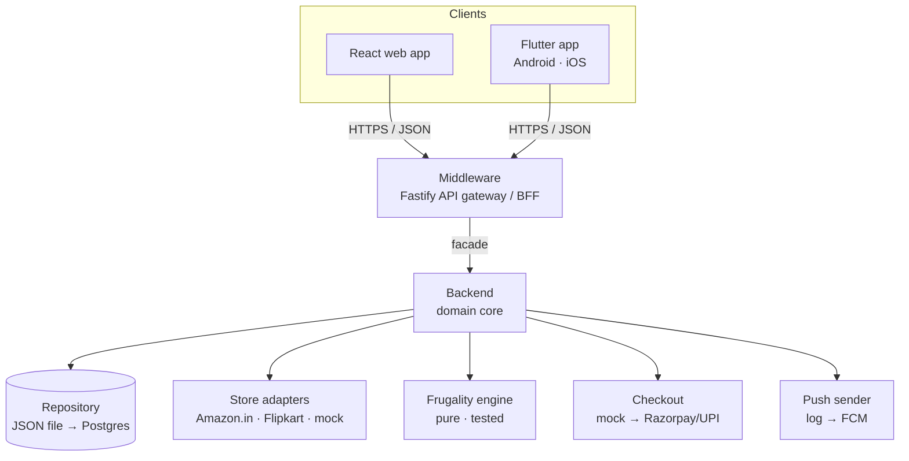
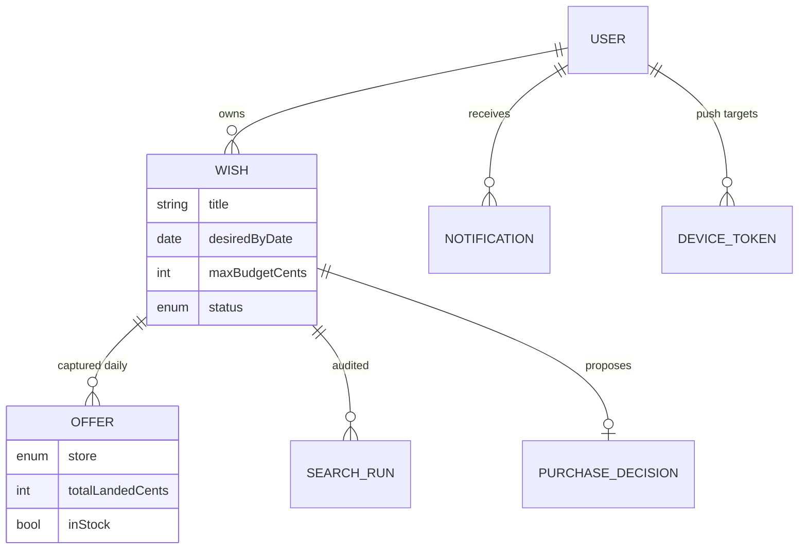

# Architecture

Patiently is a **modular monorepo** with three deployable tiers plus a shared
contract package. Boundaries are deliberately strict, so any tier can be split
into its own repository/service later with no rewrite.

All tiers share **`@patiently/shared`** — domain types + Zod schemas — the single
source of truth that the server validates against and the clients are typed
against. The Flutter model layer is **generated** from those same schemas
(`npm run codegen`).

## The tiers

| Tier | Package | Responsibility |
| --- | --- | --- |
| **Shared** | `@patiently/shared` | Domain enums, entities, DTOs as Zod schemas + derived types; money helpers (paise → ₹). |
| **Backend** | `@patiently/backend` | Repository, store adapters, frugality engine, purchase + search services, push sender, checkout. |
| **Middleware** | `@patiently/middleware` | Fastify gateway: auth (JWT), validation, routing, scheduler. The only surface clients touch. |
| **Frontend** | `@patiently/frontend` | Vite + React, mobile-first web client. |
| **Mobile** | `mobile/` (Flutter) | Native Android + iOS client; reuses the same API and generated models. |

### Why a monorepo that stays separable

- **Single source of truth.** A contract change is one edit the whole stack
  type-checks against — drift is impossible.
- **Clean seams.** The web client imports `@patiently/shared` *types only*; the
  middleware imports the backend only through the `Backend` facade. Extracting a
  tier into its own repo is a package move, not a refactor.
- **Swappable internals.** The `Repository`, `StoreAdapter`, `CheckoutProvider`
  and `PushSender` are interfaces — JSON-file → Postgres, mock → live, log → FCM,
  all without touching the services.

## Data model (essentials)

A **wish** is the intent; **offers** are the daily price observations; a
**search run** is the audit log of each pass; a **purchase decision** is the
human-in-the-loop proposal; **notifications** and **device tokens** drive the
approve-to-buy push.

## Key flows

- **Daily search** (`SearchService`): build a query → fan out to every eligible
  adapter in parallel (failures isolated) → compute landed cost → persist offers
  + a `SearchRun` → rank → if the engine says "act", create a proposal, move the
  wish to *awaiting approval*, and notify (in-app + push).
- **Approve → buy** (`PurchaseService`): you approve → `purchasing` →
  `CheckoutProvider.placeOrder` → on success `purchased` + confirmation; on
  failure, back to `active` to keep hunting.

## Productionisation checklist

- **Payments & checkout (India):** real per-store purchase automation + UPI /
  cards via Razorpay/PayU/Cashfree with tokenised payment methods, spend caps and
  fraud checks.
- **Persistence:** implement `Repository` over Postgres (Prisma) + migrations.
- **Search at scale:** move the worker to a queue (BullMQ/SQS) with per-store
  rate limiting and backoff; bias frequency up around festive sales.
- **Identity:** mobile-OTP / magic links / passkeys.
- **Notifications:** add WhatsApp Business API + SMS alongside FCM.
