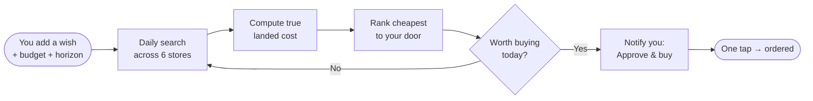
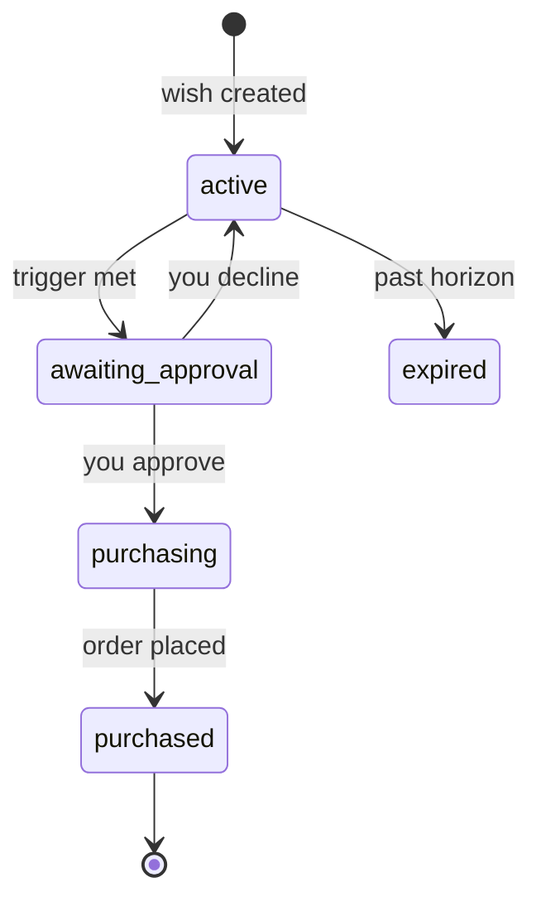

# How Patiently works

Patiently turns a vague intention ("I want noise-cancelling headphones, sometime
this year, for a fair price") into a patient, automated buying agent that does
the boring part — checking prices every day for months — and only interrupts you
when it's genuinely time to act.

## The loop

The hunt runs server-side on a schedule, so your phone does nothing until there's
a reason to ping you.

## 1. Landed cost, not sticker price

The cheapest price tag is often *not* the cheapest purchase. A ₹24,990 listing
with ₹400 shipping costs more than a ₹25,200 listing with free delivery.

Patiently normalises every offer to the **landed cost** — what actually leaves
your account:

> **landed cost = item price + shipping + tax − discounts**

In India, listed prices already include GST, so the tax term is usually zero and
we add only shipping (free over ₹500, by default) where a store doesn't quote it.
Every store is compared on the same, honest basis.

## 2. Ranking with sensible tie-breakers

Eligible offers — in stock, in an allowed store, in the right condition — are
ranked **cheapest landed cost first**. Ties break by:

1. faster delivery,
2. higher rating,
3. store trust.

You also see the **savings vs. the typical price** so you know whether today's
"best" is actually a good deal or just the least-bad option.

## 3. When do we propose a purchase?

The frugality engine proposes a buy — and pings you — when **any** of these is
true:

=== "Under budget"

    The best landed cost is at or below the budget you set. Simple: you said
    "under ₹26,990", we found it under ₹26,990.

=== "Unusual dip"

    The best price is well below the day's median across stores — a flash deal
    worth grabbing even if it's not at your target yet.

=== "Deadline near"

    Your desired-by date is approaching. We lock in the best available price
    rather than miss the window.

If none apply, we keep hunting — quietly, daily — and say nothing.

## 4. Human-in-the-loop. Always.

Patiently **never buys on its own.** When a wish hits a trigger, it moves to
*Awaiting approval* and you get a notification. On the mobile app, approval is
gated behind Face ID / fingerprint. One tap and the order is placed; otherwise it
keeps hunting.

## Why patience is the feature

Most shopping tools optimise for *speed* — buy now, one click. Patiently
optimises for *outcome* — the lowest honest price by the time you actually need
the thing. In a market with festive mega-sales (Big Billion Days, Great Indian
Festival) and constant price churn, waiting well is worth real money.

[Run it yourself](getting-started.md){ .md-button .md-button--primary }
[See the architecture](architecture.md){ .md-button }
